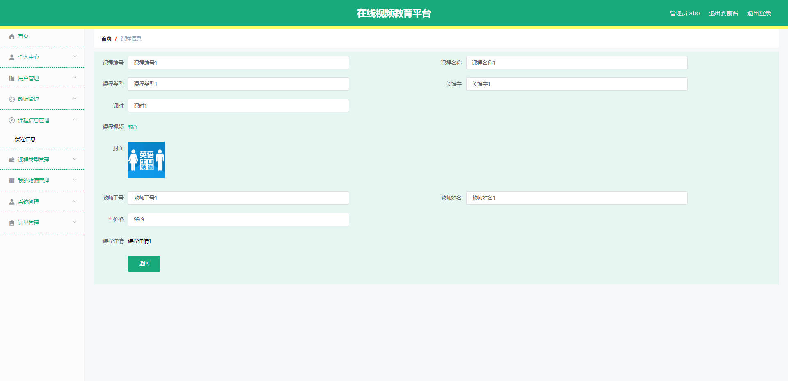
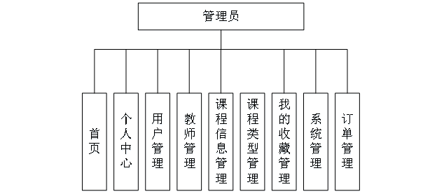

# 基于Springboot的在线视频教育平台

## Springboot-0015


## 技术栈

Springboot mybatisplus vue mysql maven


## 数据库表(13张)


## 功能介绍

```properties
管理员；首页、个人中心、用户管理、教师管理、课程信息管理、课程类型管理、我的收藏管理、系统管理、订单管理，用户；首页、个人中心、课程信息管理、我的收藏管理、订单管理、教师；首页、个人中心、课程信息管理、我的收藏管理，前台首页；首页、课程信息、个人中心、后台管理、购物车等功能
```


## 图片

### 前台


### 后台





## 访问路径

### 前台

```properties
http://localhost:8080/springbooth7te4/front/index.html#/login

账号 用户6
密码 123456
```

### 后台

```properties
http://localhost:8080/springbooth7te4/admin/dist/index.html#/login

账号 abo
密码 abo
```


## 功能图




## 文档目录


## 打赏或交流


